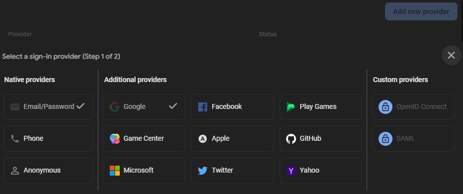
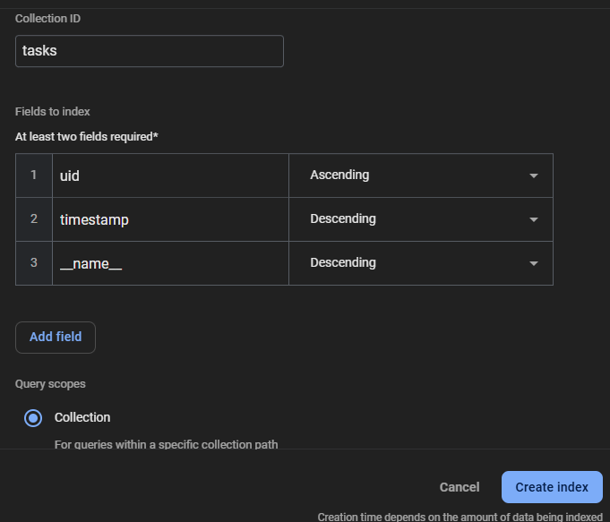
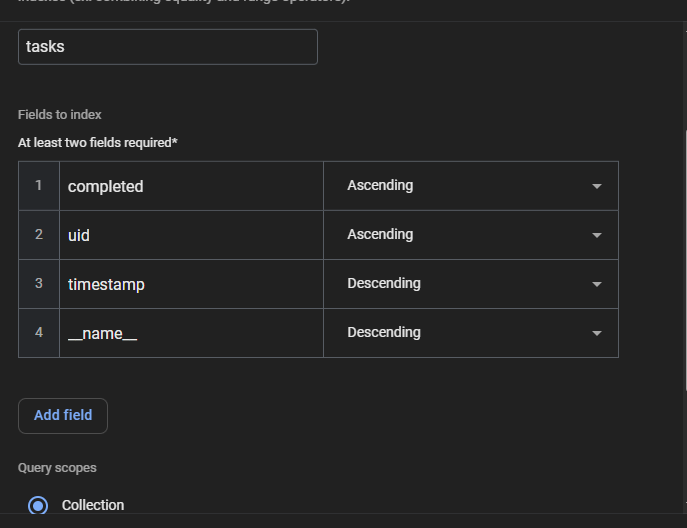

# WADS - To Do List with Authentication <br>

<br>

Simple to-do app with landing page that allows users to sign up, login, and perform basic CRUD operations for their to-do list.

<br>

## Installation

1. Install required files
```sh
npm i 
```

2. Create a .env file to connect your firebase account and put the following code inside the file
```sh
VITE_FIREBASE_API_KEY=your_api_key_here
VITE_FIREBASE_AUTH_DOMAIN=your_auth_domain_here
VITE_FIREBASE_PROJECT_ID=your_project_id_here
VITE_FIREBASE_STORAGE_BUCKET=your_storage_bucket_here
VITE_FIREBASE_MESSAGING_SENDER_ID=your_messaging_sender_id_here
VITE_FIREBASE_APP_ID=your_app_id_here
```

3. Run the app
```sh
npm run dev
```

<br>

## Firebase Config

1. Go to Firebase console and create a new app
2. Once you have reached the dashboard, go to authentication, add new providers, and select the following options:


3. After configuring the authentication settings, go to Firestore Database > Indexes and add these two indexes 



These will be used in querying the database for retrieving the to-do items per user. 

<br>

## Deployment
This app is also deployed on Vercel:  https://wads-todoapp.vercel.app/

<br>
## Tools:
* ReactJS Framework -> Main framework
* TailwindCSS Framework -> Styling
* Firebase -> Saving list to browser + Authentication
